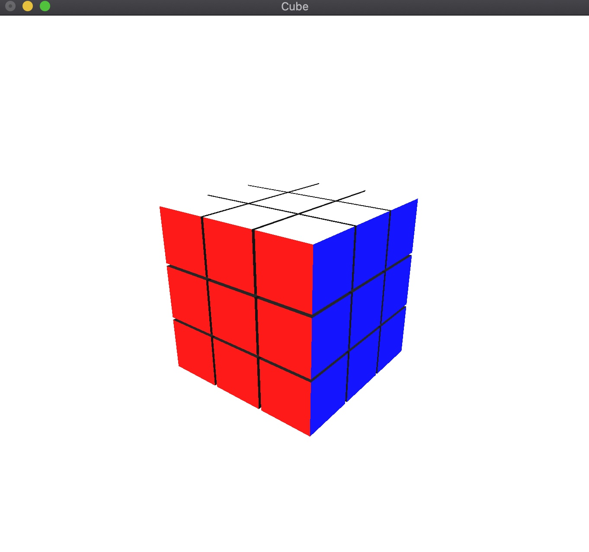

# Rubic-s-Cube
## Options
```
F1 - set default status
F2, F3 - Move camera
F4 - Download status from file
F5 + F4 - Solve
0-6 - Move planes
Mouse_right_button - Random tangling 
```

## Sample_image

